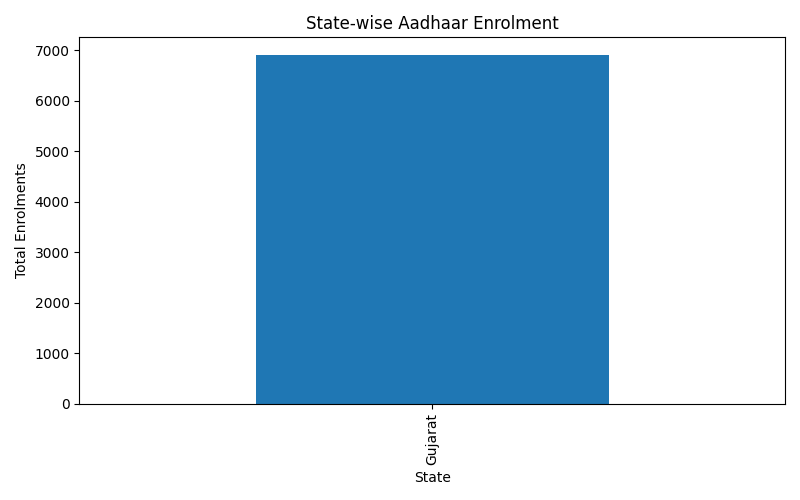
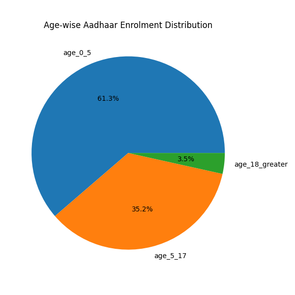
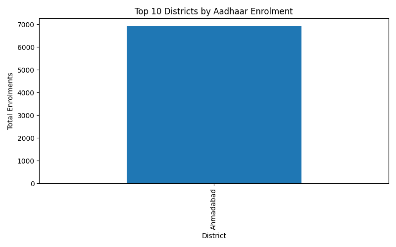
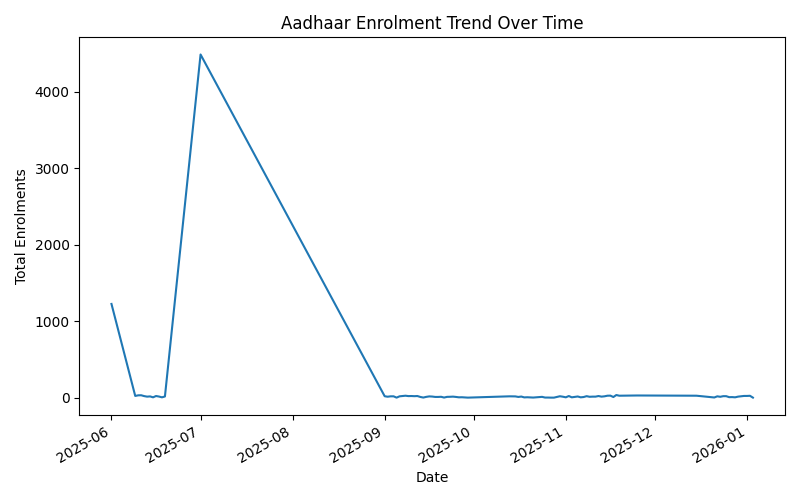

# Aadhar_Analysis

#UIDAI DATA HACKATHON 2026

# Aadhaar Enrolment Data Analysis 📊

A data analysis project built using **Python** to explore Aadhaar enrolment patterns across age groups, districts, and time. This project was developed as part of a **hackathon-style data analytics challenge** using publicly available government data.

---

## 📌 Project Overview

Aadhaar is India’s unique digital identity system. Understanding enrolment patterns helps governments and institutions improve outreach, inclusion, and service delivery.

This project analyzes Aadhaar enrolment data to answer questions such as:

* Which regions show higher enrolment activity?
* How is enrolment distributed across age groups?
* How does enrolment change over time?

The analysis is performed using **Pandas** for data processing and **Matplotlib** for visualization.

---

## 🗂 Dataset Information

* **Source:** data.gov.in (Government of India Open Data Platform)
* **Format:** CSV
* **Time Period:** June 2025 – January 2026
* **Key Columns Used:**

  * `date`
  * `state`
  * `district`
  * `pincode`
  * `age_0_5`
  * `age_5_17`
  * `age_18_greater`

> ⚠️ **Note:** The dataset primarily contains data from **Gujarat state**, which limits inter-state comparisons. However, it provides meaningful insights at district and demographic levels.

---

## 🛠 Tools & Technologies

* **Python 3**
* **Pandas** – data cleaning & aggregation
* **Matplotlib** – data visualization
* **VS Code** – development environment

---

## 🔍 Methodology

1. Loaded the dataset using Pandas
2. Performed data inspection (`head()`, `info()`, column checks)
3. Converted date column into datetime format
4. Created a new feature: **Total Enrolment**
5. Aggregated data by:

   * State
   * District
   * Age group
   * Date
6. Visualized results using bar charts, pie charts, and line plots
7. Saved visual outputs as image files for reporting

---

## 📈 Analysis & Visualizations

### 1️⃣ State-wise Aadhaar Enrolment

Shows total Aadhaar enrolments aggregated at the state level.

📌 Insight: Gujarat shows consistent enrolment activity across the dataset.



---

### 2️⃣ Age-wise Aadhaar Enrolment Distribution

Displays enrolment distribution across age groups.

📌 Insight:

* Highest enrolment observed in the **0–5 age group**
* Adult enrolment (18+) is comparatively lower, indicating saturation



---

### 3️⃣ Top 10 Districts by Aadhaar Enrolment

Identifies districts with the highest enrolment volume.

📌 Insight:

* Urban districts like **Ahmedabad** dominate enrolment figures



---

### 4️⃣ Aadhaar Enrolment Trend Over Time

Analyzes enrolment trends across the given time period.

📌 Insight:

* A sharp spike indicates enrolment drives or campaigns
* Stable trend afterward suggests enrolment saturation



---

## 💡 Key Insights

* Child enrolment (0–5 years) forms the largest share of registrations
* Urban and densely populated districts show higher enrolment
* Enrolment activity appears to be campaign-driven rather than uniform
* Time-based analysis helps identify peak enrolment periods

---

## ✅ Conclusion

This project demonstrates how public government data can be transformed into meaningful insights using basic data analytics techniques. It highlights the importance of demographic and regional analysis in public policy planning and digital inclusion initiatives.

---

## 🚀 Future Enhancements

* Predict future enrolment using machine learning reminders
* Perform district-level rural vs urban comparison
* Integrate socio-economic indicators (literacy, income)
* Build an interactive dashboard using Power BI or Streamlit

---

## ▶️ How to Run the Project

```bash
# Clone the repository
git clone https://github.com/your-username/aadhaar-enrolment-analysis.git

# Navigate to project folder
cd aadhaar-enrolment-analysis

# Install dependencies
pip install pandas matplotlib

# Run analysis
python analysis.py
```

---

## 👩‍💻 Author

**Sanjana Panchal**
Aspiring Data Analyst / Software Engineer

---

⭐ If you found this project insightful, feel free to star the repository!
